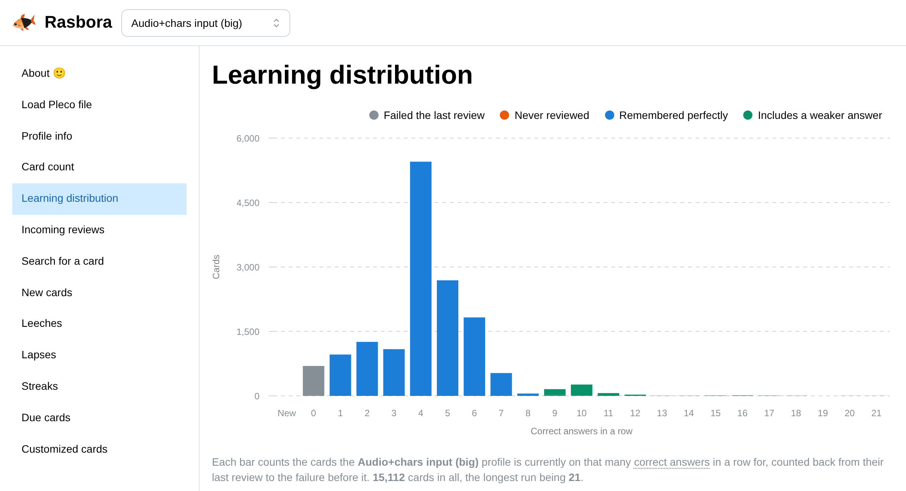
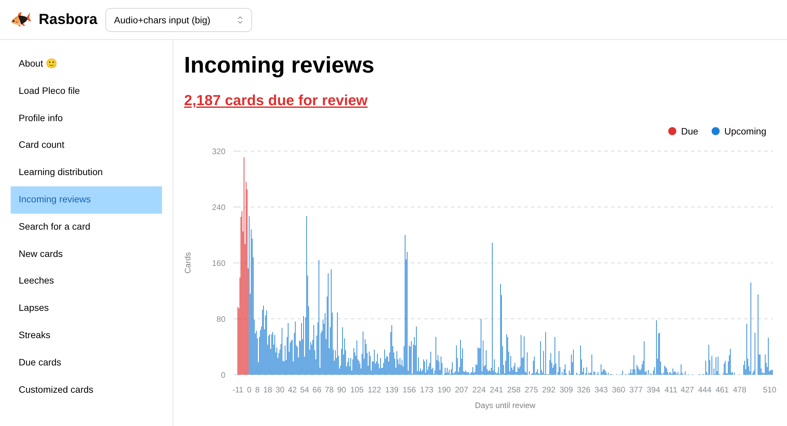
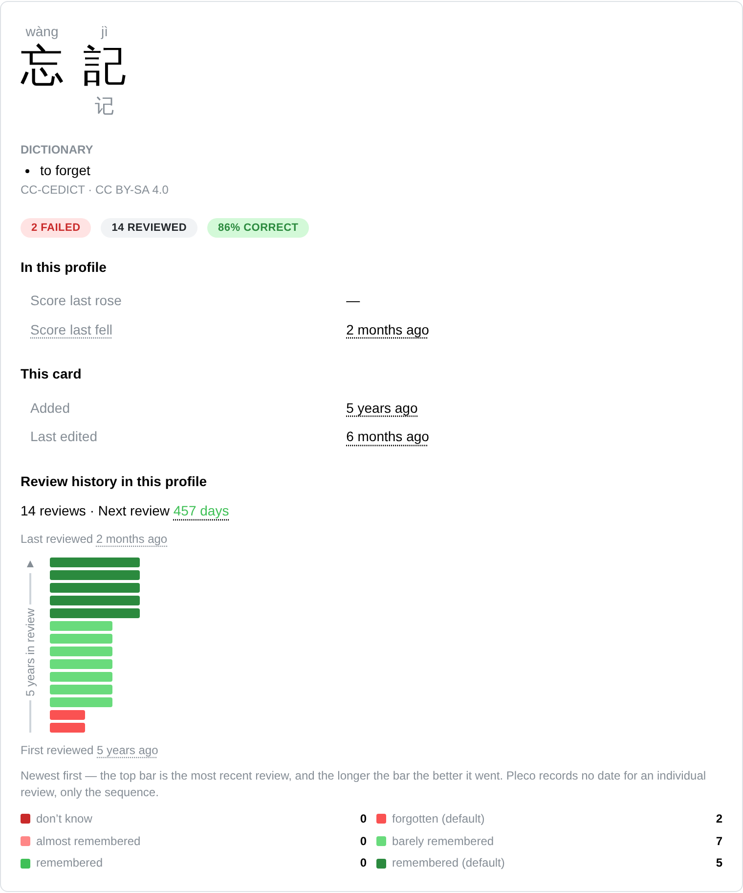

# Rasbora

**Understand your Pleco flashcards. See your progress, find the words that keep tripping you up, and see what’s due next.**

Rasbora turns your [Pleco](https://www.pleco.com/) flashcard export into interactive charts and searchable card lists.

**[Open Rasbora →](https://rasbora.martintapia.com)**

See how many cards are new, which you last got wrong, and how long the rest have gone without a mistake. Click a bar to explore its cards.

## Get started

1. Export your Pleco flashcard database as a **.pqb** file.
2. [Open Rasbora](https://rasbora.martintapia.com/load) and load that file.
3. Choose the profile you study with, then explore your cards.

Your file is processed in your browser, never uploaded to Rasbora. The browser remembers your file and selected profile for your next visit. Load a fresh export when you want to see your latest reviews.

## See what’s coming up

Explore estimated review dates, spot overdue cards, and click a day to see what needs attention. Estimates reflect the reviews saved in your export.

## Find the words that need more practice

Find **leeches** you keep getting wrong and **lapses** you used to remember. Open a card to explore its definition and review history, or search by Chinese characters, pinyin, or card ID. Choose traditional or simplified characters.

## Ask your AI agent

Give your agent the [Pleco flashcards skill][skill] and your export, then ask questions such as “Which words do I keep forgetting?” The skill helps your agent read the export and link you to cards in Rasbora.

[Usage guide](docs/usage.md) · [Development](AGENTS.md#commands) · [Report a problem](https://github.com/paps/rasbora/issues)

Dictionary definitions come from [CC-CEDICT](https://www.mdbg.net/chinese/dictionary?page=cc-cedict), licensed under [CC BY-SA 4.0](https://creativecommons.org/licenses/by-sa/4.0/).

[skill]: https://raw.githubusercontent.com/paps/rasbora/refs/heads/main/.agents/skills/pleco-flashcards/SKILL.md
